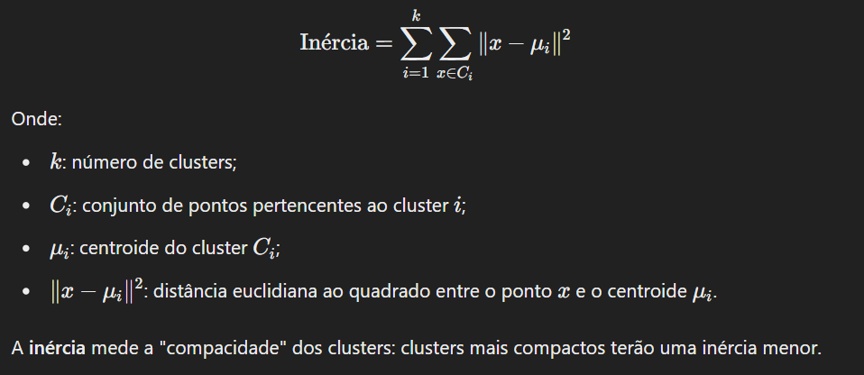
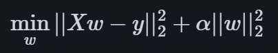
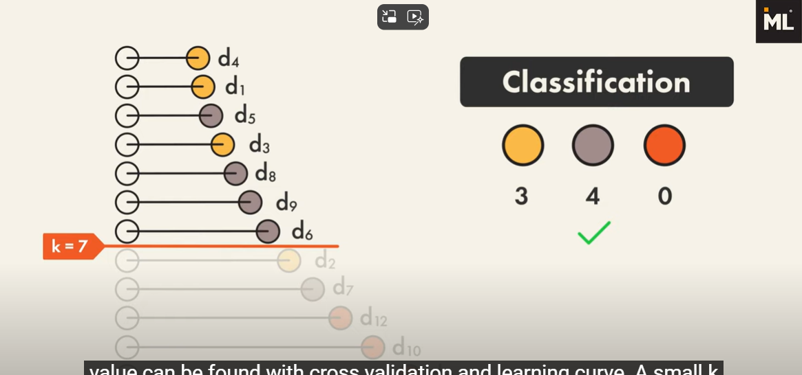
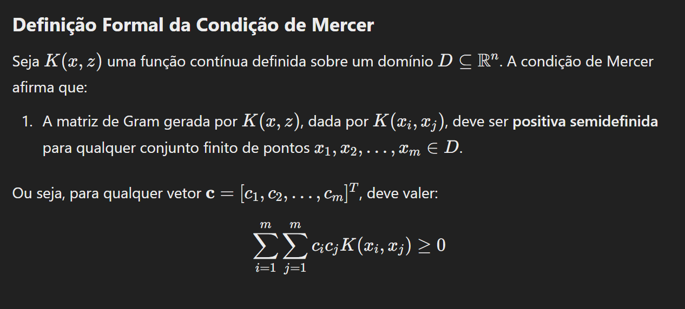
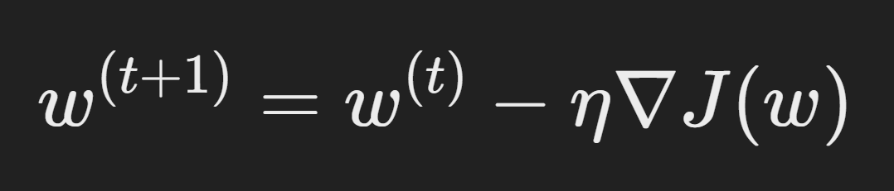
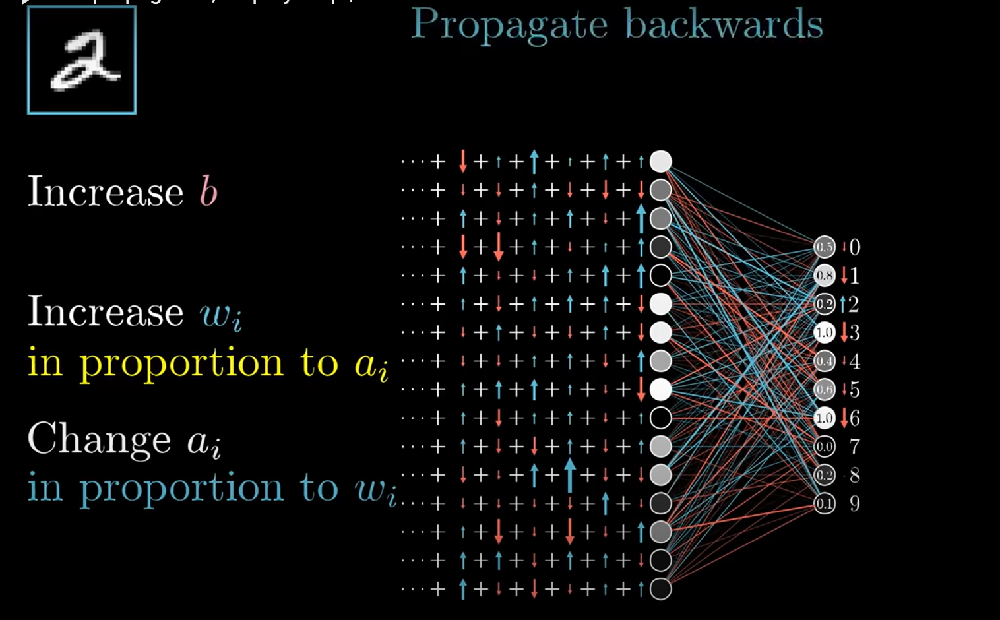

# Orgonograma geral de Aprendisagem de Máquina

## Aprendisagem não supervisionada:

### K-means

#### Algoritmo de Floyd:

1. Fixar os centros iniciais.
2. Calcular a matriz de distâncias em relação à esses centros iniciais.
3. Setar k
4. Calcular o novo centro.
5. Repetir.

#### Inércia:

No contexto do k-means, a inércia é uma medida que representa a soma das distâncias ao quadrado entre os pontos dos dados e os centroides (médias) dos grupos aos quais esses pontos foram atribuídos. Em termos formais:

#### Método do Cotovelo (Elbow Method)

A inércia mínima é frequentemente usada para determinar o número ideal de clusters em um conjunto de dados.
No método do cotovelo, traça-se a inércia mínima em função de diferentes valores de 𝑘.
O ponto onde a inércia começa a diminuir de forma mais lenta (formando um "cotovelo" no gráfico) é escolhido como o número ideal de clusters.

### Classificação Hierárquica

organizar e classificar dados em uma estrutura hierárquica, onde as classes ou categorias estão dispostas em diferentes níveis de especificidade. Essa técnica é especialmente útil em problemas onde as classes têm uma relação hierárquica natural, como taxonomias biológicas, categorias de produtos, ou classificação de documentos.

## Aprendisagem Supervisionada:

### Modelos Linear

#### Regressão Ridge

Ele endereça alguns erros de Ordem Mínima quadrática impondo uma penalidade no tamanho dos coeficientes.

##### Regressão Lasso

Reduz o número de features com a qual a solução é dependente. Adiciona um fator de normalização inversamente proprocional ao dobro da amostra.

### Classificação Hierárquica

#### Single Linkage (Ligação Simples)

A distância entre dois clusters é definida como a menor distância entre qualquer ponto de um cluster e qualquer ponto do outro cluster.
Quando você deseja clusters que conectem pontos com base em proximidade direta.

#### Complete Linkage (Ligação Completa)

A distância entre dois clusters é definida como a maior distância entre qualquer ponto de um cluster e qualquer ponto do outro cluster.

#### Average Linkage (Ligação Média)

A distância entre dois clusters é definida como a média das distâncias entre todos os pares de pontos, sendo um ponto de cada cluster.

#### Ward's Method (Critério de Ward)

Minimiza o aumento da variância interna ao combinar clusters.
A distância entre clusters é baseada no aumento da soma dos quadrados das distâncias dos pontos ao centroide.

### Perceptron (Supervisionado)

Classifieur Lineaire. Se os dados não são separáveis o algoritmo não converge.
O Perceptron tenta apenas encontrar um hiperplano de separação qualquer que consiga dividir os dados linearmente separáveis.
Ele ajusta os pesos iterativamente corrigindo erros de classificação, sem se preocupar com a "qualidade" do hiperplano escolhido.
Não possui uma função objetivo global para ser minimizada (apenas segue uma regra de atualização).

Não posssui regularização.

Tanto o Perceptron quanto as redes neurais usam combinações lineares de entradas (com pesos e bias) e aplicam funções de ativação para produzir uma saída.

### Redes Neurais

Um Perceptron simples é o componente fundamental de uma rede neural. Redes neurais podem ser vistas como uma composição de Perceptrons multicouches (multicamadas), organizados em camadas (input, hidden e output).

O número de **parâmetros** no modelo (d+1)n + (n+1)s, onde d são os neuronios de entrada, n neurônios na camada escondida e s neurônios na camada de saída.

### K-NN

1. Calcular a distância do ponto aos outros. (euclidiana ou manhatan)
2. Ordenar pelos vizinhos mais próximos do ponto
3. Para o problema de classificação, ele é classificado de acordo com o maioria dos seus vizinhos.
   

#### Score Leave-One-Out

O leave-one-out cross-validation é uma técnica para avaliar um classificador:

Cada vez, retiramos uma única observação da base de treinamento e usamos o restante para treinar o modelo.

Classification: Cada observação aparenta à uma classe.

Regression: Cada observação está associada à uma grandeza escalar ou vetorial.

### SVM (Máquinas de Suporte) Supervisionado

O SVM, diferentemente do Perceptron, busca um hiperplano ótimo, que maximize a margem entre as classes (a distância mínima entre o hiperplano e os pontos de cada classe).

#### A astúcia do kernel

A relação entre uma função de plongement φ(x) e um núcleo k(x, z) baseia-se no **produto interno** no espaço de características. O núcleo k(x, z) é uma forma compacta de calcular este produto interno, sem necessidade de computar explicitamente a transformação φ(x).

Este documento apresenta um **passo a passo** para determinar o núcleo correspondente a uma transformação φ(x), como no exemplo fornecido:

φ(x1, x2) = (x1² - x2², x1x2, x1² + x2²)

**1. Definir o Produto Interno no Espaço de Características**

O núcleo k(x, z) é definido como o produto interno no espaço transformado:

k(x, z) = ⟨φ(x), φ(z)⟩

Isso significa que, dado φ(x) e φ(z), você precisa calcular:

⟨φ(x), φ(z)⟩ = ∑ φi(x) φi(z)

Onde φi(x) representa os componentes da transformação φ(x).

**2. Substituir φ(x) e φ(z)**

Escreva explicitamente a transformação fornecida. No caso da questão, a transformação é:

φ(x1, x2) = (x1² - x2², x1x2, x1² + x2²)

Agora, substituímos dois vetores (x1, x2) e (z1, z2) na definição do produto interno:

⟨φ(x), φ(z)⟩ = (x1² - x2²)(z1² - z2²) + (x1x2)(z1z2) + (x1² + x2²)(z1² + z2²)

**3. Expandir os Termos**

Expanda os termos do produto interno:

(x1² - x2²)(z1² - z2²) = x1²z1² - x1²z2² - x2²z1² + x2²z2²

(x1² + x2²)(z1² + z2²) = x1²z1² + x1²z2² + x2²z1² + x2²z2²

Somando todos os termos:

⟨φ(x), φ(z)⟩ = 2x1²z1² + 2x2²z2² + 2x1x2z1z2

**4. Reconhecer a Forma do Núcleo**

Observe que o resultado acima é equivalente ao desenvolvimento de:

(x1z1 + x2z2)²

Isso é um **núcleo polinomial de grau 2**.

#### Condição de Mercer

Os núcleos (kernels) são usados para transformar dados em um espaço de alta dimensão onde problemas não linearmente separáveis podem se tornar linearmente separáveis.

Um kernel é uma função que calcula um produto interno em um espaço transformado (espaço de características), sem a necessidade de calcular explicitamente as transformações.
𝐾(𝑥,𝑧)=𝜙(𝑥)⋅𝜙(𝑧)

Para que K(x,z) seja válido, ele deve respeitar a condição de Mercer.

## Maledição da Dimensão

O volume da esfera unidade em 𝑅^𝑑 decai rapidamente com o aumento de 𝑑, enquanto o volume do cubo circunscrito cresce exponencialmente. Isso implica que, em alta dimensão, os pontos tendem a se concentrar nas extremidades ou "cantos" do espaço, reduzindo a eficácia de métodos baseados em distância.

# Definições

## Matriz de Confusão

A matriz de confusão é uma ferramenta usada para avaliar o desempenho de um modelo de classificação. Ela mostra como as previsões do modelo se comparam aos valores reais, organizando os dados em uma tabela que resume as predições corretas e incorretas de cada classe.
Diagonal principal: Valores onde o modelo previu corretamente a classe
Valores fora da diagonal: Erros de classificação (exemplo: a classe 0 foi erroneamente classificada como classe 1, 2 vezes).

Em suma, o valor em cada célula `(i, j)` mostra quantas vezes uma observação da classe real i foi prevista como pertencendo à classe j.

|                   | Previsto Classe 0 | Previsto Classe 1 | Previsto Classe 2 | Previsto Classe 3 | Previsto Classe 4 | Previsto Classe 5 |
| ----------------- | ----------------- | ----------------- | ----------------- | ----------------- | ----------------- | ----------------- |
| **Real Classe 0** | 50                | 2                 | 1                 | 0                 | 3                 | 0                 |
| **Real Classe 1** | 4                 | 45                | 2                 | 3                 | 1                 | 0                 |
| **Real Classe 2** | 2                 | 3                 | 47                | 2                 | 1                 | 1                 |
| **Real Classe 3** | 0                 | 2                 | 4                 | 48                | 0                 | 1                 |
| **Real Classe 4** | 3                 | 1                 | 0                 | 0                 | 49                | 2                 |
| **Real Classe 5** | 0                 | 0                 | 3                 | 2                 | 1                 | 44                |

Por exemplo na linha 1: A classe real é Classe 0.
O modelo:

- Previu 50 vezes corretamente como Classe 0.
- Previu 2 vezes erroneamente como Classe 1.
- Previu 1 vez erroneamente como Classe 2.
- E assim por diante.

## Função de Custo

Ela quantifica a diferença entre as previsões do modelo e os valores reais esperados (dados rotulados no caso supervisionado).
Exemplos de funções de custo: Erro quadrático médio (MSE).

## Gradiente de Descida

O gradiente de descida é um algoritmo de otimização que ajusta iterativamente os parâmetros do modelo para minimizar a função de custo.

Ele usa o gradiente, que é o vetor de derivadas parciais da função de custo em relação aos parâmetros do modelo (𝑤), para indicar a direção do aumento mais rápido da função de custo.

Em vez de seguir essa direção, o gradiente de descida move-se no sentido oposto (descendo), reduzindo a função de custo.

Movendo-se no sentido oposto ao gradiente (−∇𝐽(𝑤)), a função de custo diminui.

## Backpropagation

A retropropagação é o algoritmo usado para determinar como um único exemplo de treinamento pode ajustar **(nudge)** os pesos e vieses (biases) de uma rede neural. Ela não apenas indica se esses valores devem aumentar ou diminuir, mas também em qual **proporção relativa** essas mudanças devem ocorrer para reduzir o custo de maneira mais rápida. Em um passo ideal de descida do gradiente, seria necessário calcular isso para todos os milhares de exemplos de treinamento e, em seguida, calcular a média das mudanças desejadas. No entanto, isso é computacionalmente lento. Em vez disso, os dados são divididos aleatoriamente em pequenos lotes **(mini-batches)** e cada passo é calculado com base em um desses lotes.

## Entropia cruzada

É a função de perda mais adequada para problemas de classificação multiclasses, pois avalia a diferença entre as probabilidades previstas pelo modelo e as classes verdadeiras (usando rótulos codificados como "one-hot").
