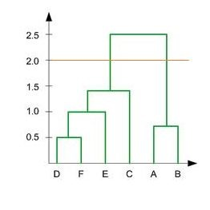
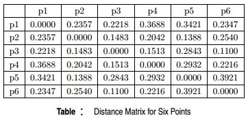
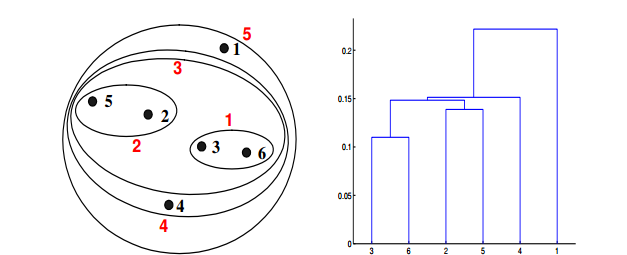
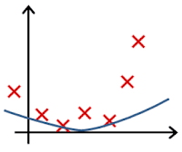
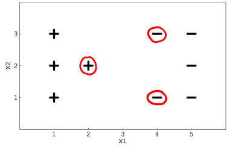
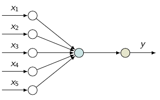
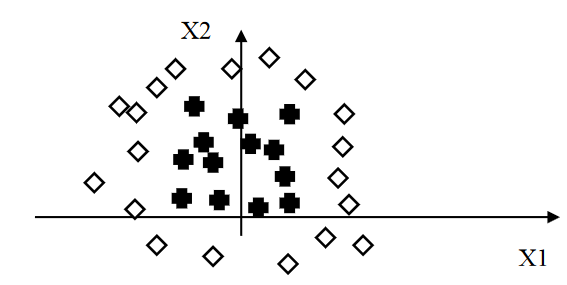

## Seance 1

1. Les logiciels malware (des logiciels espions, des virus, etc.) sont souvent obtenus en modifiant légèrement le code d'un malware existant: on peut donc identifier des "familles de malware". En 2015, Microsoft a fourni à la communauté "machine learning" un dataset formé d'un grand nombre d'empreintes du code de malwares pour lesquels on connaît la famille d'appartenance: chaque empreinte est associée à une famille parmi neuf. L'objectif est de prédire la famille d'un nouveau malware. Il s'agit d'un problème de:

a.partitionnement
b.classification supervisée
c.régression

La réponse correcte est : classification supervisée

2. Une organisation non-gouvernementale (ONG) fournissant de l'aide humanitaire voudrait savoir où concentrer ses efforts. Pour chaque pays, l'ONG dispose de différents indicateurs de santé et socio-économiques. Le travail du data-scientist est alors d'établir des sous-ensembles de pays au profil similaire. Il s'agit d'un problème de:

a.régression
b.partitionnement
c.classification supervisée

La réponse correcte est : partitionnement

3. Qu'est-ce qui différencie les modèles de la régression ridge et le lasso ?

a.le nombre d'hyperparamètres
b.le nombre de caractéristiques
c.la norme sur les paramètres du modèle
d.la norme sur les résidus du modèle
e.le nombre d'observations

La réponse correcte est : la norme sur les paramètres du modèle

Vous souhaitez prédire le temps au 1000-mètres d'athlètes en fonction de leur genre, taille, poids, âge, puissance musculaire, capacité pulmonaire. Vous êtes face à un problème de:

1.  classification supervisée
2.  régression
3.  partitionnement

La réponse correcte est : régression

## Seance 2

1. Dans l'algorithme de Lloyd des k-moyennes, à chaque itération on affecte une observation:

1.à la classe la plus lourde
2.à la classe dont la moyenne est la plus proche
3.à la classe ayant le plus d'observations

La réponse correcte est : à la classe dont la moyenne est la plus proche

2.Pendant le déroulement de l'algorithme des K
-moyennes (algorithme de Lloyd), il est possible que les assignations des observations aux groupes ne changent plus d'une itération à l'autre.

a.Vrai
b.Faux
c.On ne peut pas le prévoir

La réponse correcte est : Vrai

3.On considère un problème de partitionnement de deux classes en dimension 6 que l'on traite par la méthode des K-moyennes (algorithme de Lloyd), avec K=2.

On obtient 50 partitions en exécutant l'algorithme avec 50 initialisations aléatoires différentes.

Comment choisir l'une des partitions ?

a.en visualisant les partitions et en choisissant manuellement la meilleure
b.on choisit le résultat de la 50ème exécution, car à partir de la 50ème initialisation aléatoire l'algorithme doit avoir convergé
c.en sélectionnant la partition d'inertie minimale
d.avec la méthode du coude (elbow method)

La réponse correcte est : en sélectionnant la partition d'inertie minimale

4. Une classification hiérarchique nous fournit le dendrogramme ci-dessous. Combien de groupes obtient-on en décidant d'un seuil de partitionnement à la hauteur 2.0 ?

a.3
b.1
c.4
d.2
e.autre réponse

La réponse correcte est : 2

5. Etant donnés 6 points du plan dont les distances deux-à-deux sont données par le tableau suivant:

Quels sont les partitionnements et dendrogrammes obtenus par classification hiérarchique ascendante et critère "single linkage"?
Rappel: Selon le critère single linkage, à chaque étape on combine les deux groupes qui contiennent la paire d'observations les plus proches n'appartenant pas encore au même groupe.
Remarque. La représentation graphique ci-dessous respecte les distances du tableau.

## Seance 3

1. Les graphiques suivants illustrent un problème de régression: il s'agit de prédire la valeur en ordonnée à partir de la valeur en abscisse, les croix représentant des observations. La courbe bleue représente la prédiction. Quelle situation illustre le phénomène de sur-apprentissage ?

2.Le théorème de Bayes appliqué à la classification supervisée permet d'écrire:

1.que maximiser p(C|x) revient à maximiser p(C)p(x|C)
2.que la somme sur toutes les classes C_i de p(x| C_i) vaut 1
3.que les probabilités a priori sont uniformes

La réponse correcte est : que maximiser p(C|x) revient à maximiser p(C)p(x|C)

3. Qu'est-ce qui est gaussien dans le classifieur Gaussian Naive Bayes?

1.les lois marginales des caractéristiques conditionnées à la classe d'appartenance de l'observation
2.l'inversion par pivot du système linéaire
3.c'est Gauss qui l'a inventé

La réponse correcte est : les lois marginales des caractéristiques conditionnées à la classe d'appartenance de l'observation

4. Qu'est ce qui est "naïf" dans le classifieur naïf de Bayes?

a.l'hypothèse de régularisation
b.l'hypothèse d'indépendance conditionnelle des caractéristiques
c.l'hypothèse de gaussianité
d.l'utilisation de la norme euclidienne

La réponse correcte est : l'hypothèse d'indépendance conditionnelle des caractéristiques

5.Le classifieur de la régression logistique permet de résoudre des problèmes de:

a.partitionnement
b.régression
c.classification

La réponse correcte est : classification

6. Le classifieur qui suit le principe du maximum a posteriori:

a.est aussi appelé classifieur de Bayes dans le cours
b.définit un classifieur théorique optimal sous hypothèse d'un coût 0-1
c.consiste à associer une observation à la classe de probabilité a posteriori la plus élevée

La réponse correcte est : tout est vrai!

## Seance 4

1. On s'intéresse à un problème de classification supervisée à 3 classes. On souhaite mettre en oeuvre le modèle des SVM biclasses via l'approche "un contre tous" (one-versus-all). Combien de SVM faudra-t-il entraîner ?

a.1
b.2
c.3
d.4
e.5
f.6

La réponse correcte est : 3

2.Quel est l'intérêt de l'astuce du noyau (kernel trick)?

a.Elle permet aux SVM de définir des surfaces de séparation différentes des hyperplans
b.Elle permet aux SVM de résoudre des problèmes de régression plutôt que de classification
c.Elle permet de transformer un problème d'apprentissage non-supervisé en un problème d'apprentissage supervisé
d.Elle permet d'accélérer l'apprentissage

La réponse correcte est : Elle permet aux SVM de définir des surfaces de séparation différentes des hyperplans

3. On considère une SVM à noyau linéaire entraînée sur les observations appartenant à deux classes + et - ci dessous.
   Les vecteurs supports sont entourés en rouge.

Répondez par vrai ou faux:
A) Si une observation entourée en rouge est retirée des données d'apprentissage, un nouvel entraînement donnera une nouvelle frontière de classification.
B) Si une observation qui n'est pas entourée en rouge est retirée des données d'apprentissage, un nouvel entraînement donnera une nouvelle frontière de classification.

a.A) Faux B) Faux
b.A) Vrai B) Vrai
c.A) Vrai B) Faux
d.A) Faux B) Vrai

La réponse correcte est : A) Vrai B) Faux

4. La classe prédite par une machine à vecteurs supports ne dépend pas de toutes les observations de la base d'apprentissage.

i.Faux
ii.Vrai

La réponse correcte est : Vrai

5. Dans une SVM, les vecteurs supports sont des observations.

a.Faux
b.Vrai

La réponse correcte est : Vrai

6.L'astuce du noyau...

Question 6Veuillez choisir au moins une réponse.

a.ne change rien à la classification obtenue sans cette astuce mais accélère le calcul
b.permet de rendre non-linéaire des modèles d'apprentissage basés sur la notion de produit scalaire
c.porte ce nom car elle permet d'accélérer le calcul en utilisant le noyau du système d'exploitation
d.remplace le produit scalaire euclidien par une fonction à deux variables vérifiant les conditions de Mercer

La réponse correcte est : b et d

## Seance 5

1.Un réseau de neurones pour la classification biclasse à une couche cachée formée d'un seul neurone (comme le réseau ci-dessous) est un classifieur linéaire.

La sortie est de ce réseau correspondant à une entrée x1,…,xd est σ(f(∑di=1wixi+b)) où σ est la sigmoide, f l'activation du neurone caché, d le nombre de neurones en entrée, wi les poids des liaisons arrivant au neurone caché, b le biais.

Comme σ et f sont croissantes, imposer σ(f(∑di=1wixi+b))>1/2 (resp. ) est équivalent à imposer ∑di=1wixi+K>0 (resp. ): la surface de séparation des classes est un hyperplan de Rd.

La réponse correcte est : Vrai

2. Une époque (epoch) est:

a.une étape de l'apprentissage du réseau correspondant à un parcours de l'ensemble de la base d'apprentissage
b.le nombre d'itérations de la descente de gradient avant convergence
c.le nombre de couches cachées
d.le calcul du coût d'erreur sur la base de test

La réponse correcte est : une étape de l'apprentissage du réseau correspondant à un parcours de l'ensemble de la base d'apprentissage

3. On considère le problème de classification biclasse suivant:

Un perceptron multicouche permettant de séparer correctement les deux classes aura l'architecture suivante:

a.un neurone en entrée, au moins une couche cachée, deux neurones en sortie
b.deux neurones en entrée, au moins une couche cachée, deux neurones en sortie
c.deux neurones en entrée, au moins une couche cachée, un neurone en sortie
d.deux neurones en entrée, aucune couche cachée, un neurone en sortie
e.deux neurones en entrée, aucune couche cachée, deux neurones en sortie
f.un neurone en entrée, au moins une couche cachée, un neurone en sortie

La réponse correcte est : deux neurones en entrée, au moins une couche cachée, un neurone en sortie

4.L'entraînement d'un réseau de neurones artificiels consiste à minimiser le coût des erreurs sur la base d'apprentissage en fonction des poids du réseau.

a.Faux
b.Vrai

La réponse correcte est : Vrai

5. L'algorithme de rétropropagation des erreurs permet de calculer une approximation numérique du gradient du coût d'erreur.

a.Vrai
b.Faux

La réponse correcte est : Faux, car
Il s'agit d'un algorithme de calcul exact du gradient (dès qu'on dispose de la dérivée des activations bien entendu). Il tire parti de la forme particulière que prend la sortie d'un réseau de neurones et du théorème de dérivation des fonctions composées.

6.Pour obtenir un réseau de neurones très performant, il suffit de définir un réseau avec de nombreux neurones cachés et faire tourner l'apprentissage très longtemps.

a. Vrai
b. Faux

La réponse correcte est : Faux

L'apprentissage minimise l'erreur sur la base d'apprentissage, donc un réseau complexe finira vraisemblablement par faire du surapprentissage et n'aura pas de bonnes capacités de généralisation.

## Seance 6

1. Le dropout consiste à supprimer des observations de la base d'apprentissage

a.Faux
b.Vrai

La réponse correcte est : Faux, car le dropout consiste à mettre à zéro aléatoirement certains poids pendant l'apprentissage d'un batch de manière à éviter le surapprentissage.

2.Ce qu'on appelle taux d'apprentissage en machine learning est le pas de l'algorithme du gradient en optimisation numérique.
Question 2Veuillez choisir une réponse.

a. Vrai
b. Faux

La réponse correcte est : Vrai

3. Un réseau de neurones convolutif est un cas particulier des réseaux feed-forward (perceptron multi-couches)

a.Faux
b.Vrai

La réponse correcte est : Vrai

4. L'avantage principal des CNN est:

a. Ils peuvent traiter directement des images ou des sons et ne nécessitent pas de spécifier des descripteurs de l'information pertinente contenue dans le signal, qui dépendent du domaine applicatif
b. Ils fonctionnent bien avec toute tâche d'IA
c. Ils ont les meilleures performances parmi tous les modèles d'apprentissage

La réponse correcte est : Ils peuvent traiter directement des images ou des sons et ne nécessitent pas de spécifier des descripteurs de l'information pertinente contenue dans le signal, qui dépendent du domaine applicatif

5. Les CNN sont:

a.adaptés à tout problème d'apprentissage supervisé
b.bien adaptés pour la prédiction de Spams
c.principalement des outils pour traiter des problèmes d'apprentissage supervisé sur des données "image" ou "son"
d.des modèles de clustering

Un CNN traite des tâches d'apprentissage supervisé: l'apprentissage se fait à l'aide d'observations étiquetées. L'opérateur de convolution est l'opérateur de base du traitement du signal (images et sons), il implique un traitement de l'information invariant par translation. Cette hypothèse d'invariance n'est pas forcément adaptée à tout domaine applicatif. Par exemple dans l'application à la détection de Spams, cette hypothèse n'a pas de sens: il n'y a aucune raison de faire une convolution sur le vecteur décrivant chaque texte, qui regroupe des informations de nature différente.

La réponse correcte est : principalement des outils pour traiter des problèmes d'apprentissage supervisé sur des données "image" ou "son"

6. On cherche à résoudre un problème de classification supervisée à quatre classes à l'aide d'un réseau de neurones. Que choisit-on comme activation pour la couche de sortie et comme loss?

a.Activation: sigmoïde - Fonction de perte (loss): mean squared error
b.Activation: soft-max - Fonction de perte (loss): entropie croisée
c.Activation: sigmoïde - Fonction de perte (loss): entropie croisée
d.Activation: soft-max - Fonction de perte (loss): mean squared error

La réponse correcte est : Activation: soft-max - Fonction de perte (loss): entropie croisée
